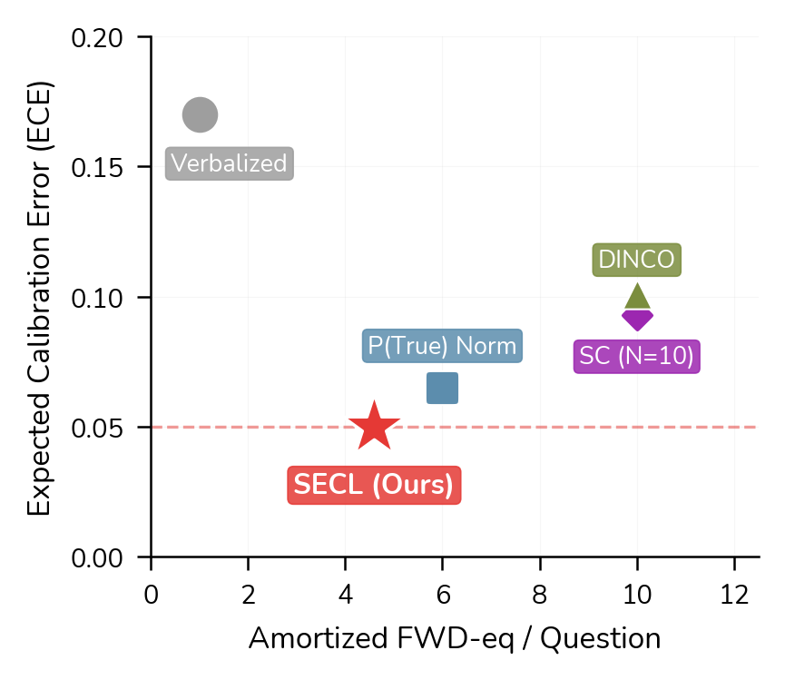
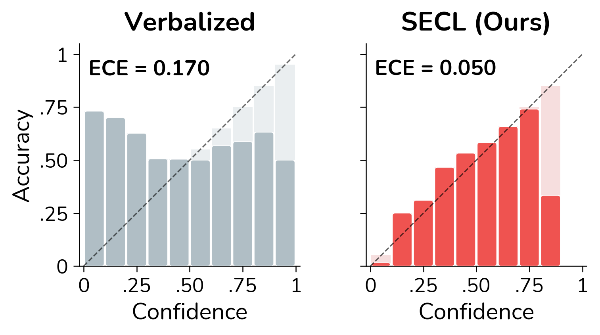

# SECL: Self-Calibrating Language Models via Test-Time Discriminative Distillation

[](https://arxiv.org/abs/2604.09624)
[](https://2026.emnlp.org/)
[](LICENSE)
[](https://www.python.org/)
[](https://pytorch.org/)

**[Mohamed Rissal Hedna](https://arxiv.org/a/hedna_m_1), Jan Strich, Martin Semmann, Chris Biemann** &nbsp;·&nbsp; University of Hamburg

📄 **Paper:** [arXiv:2604.09624](https://arxiv.org/abs/2604.09624)

> **SECL** is the first **test-time training** method for **LLM confidence calibration**. It exploits the *generation–discrimination gap* as label-free self-supervision: a lightweight LoRA adapter is trained online so that a model's verbalized confidence tracks its better-calibrated normalized **P(True)** signal — **no labels, no human supervision**.

<p align="center">
  
</p>
<p align="center">
  <em><b>Overview of SECL.</b> (a) Test-time inference: an entropy-based change detector monitors the input stream; if no shift is detected, the adapted model is used directly, otherwise a calibration burst updates it. (b) Calibration burst: the frozen model generates an answer with confidence and distractors, computes NormP(True), and applies a bounded LoRA update only when the two signals disagree by more than one bin. Weights accumulate across questions.</em>
</p>

---

## Table of Contents

- [Overview](#overview)
- [Method](#method)
- [Key Results](#key-results)
- [Installation](#installation)
- [Reproducing Main Results](#reproducing-main-results)
- [Reproducing Baselines](#reproducing-baselines)
- [Reproducing Ablations](#reproducing-ablations)
- [Key Arguments](#key-arguments)
- [Repository Structure](#repository-structure)
- [Hardware Requirements](#hardware-requirements)
- [Citation](#citation)
- [License](#license)
- [Acknowledgments](#acknowledgments)

---

## Overview

Large language models are systematically **overconfident**: they routinely express high certainty on questions they often answer incorrectly. Existing calibration methods either require labeled validation data, degrade under distribution shift, or incur substantial inference cost.

Recent work shows that LLMs already contain a *better-calibrated* signal than the one they verbalize: the token probability of "True" when the model is asked "Is this answer correct?" — **P(True)** — consistently outperforms a model's stated confidence. This is theoretically grounded: a model's generative error is lower-bounded by roughly **twice** its discriminative error.

**SECL** (**SE**lf-**C**alibrating **L**anguage models) turns this gap into label-free self-supervision via a test-time training (TTT) pipeline:

- **Label-free & online.** A normalized P(True) signal from the *frozen* base model supervises lightweight LoRA updates that adjust verbalized confidence.
- **Adapts only on shift.** Page–Hinkley entropy gating triggers adaptation only when the input distribution changes, so SECL trains on just **6–26%** of the stream — at *lower* cost than the baseline it distills from.
- **Strong, robust gains.** Across **4 small LLMs** (3 model families) and **4 domains**, SECL reduces Expected Calibration Error (ECE) by **56–78%**, surpassing its own supervision signal and matching or beating recent inference-time methods.

---

## Method

SECL operates in three stages (see the overview figure above):

1. **Adaptive entropy gating.** The entropy of the model's output distribution is tracked with an EMA and monitored with the Page–Hinkley change-detection test. When a distribution shift is detected, a *calibration burst* of `B = 50` consecutive questions is initiated. LoRA weights **accumulate** across domains without resetting.
2. **Normalized P(True) as self-supervision.** For each answer, raw `P(True)` is normalized via a softmax over distractor answers (multiple-choice options, or `K = 4` generated alternatives for open-ended questions). This removes suggestibility bias and yields a *relative* confidence target, `NormP(True)`.
3. **Test-time calibration via LoRA.** When verbalized confidence disagrees with `NormP(True)` by more than one bin, a **bounded directional update** nudges confidence toward the target with a clipped step (mitigating noise/overshoot), trained with an MSE loss via AdamW. Crucially, `NormP(True)` is always computed from the **base model without adapters**, so the supervision signal is never corrupted by ongoing adaptation.

---

## Key Results

SECL achieves the **lowest calibration error at a fraction of the inference cost** of competing methods.

<p align="center">
  
</p>
<p align="center">
  <em>Calibration error vs. inference cost for Llama 3.2-3B (lower-left is better). SECL reaches the lowest ECE at far lower cost than P(True) Norm, DINCO, and self-consistency.</em>
</p>

**Expected Calibration Error (ECE, lower is better)** across the full 2,000-question stream:

| Method | Cost (fwd-eq/q) | Llama 3.2-3B | Llama 3.1-8B | Gemma 2-2B | Phi 3.5-Mini |
|---|:---:|:---:|:---:|:---:|:---:|
| Verbalized (no adaptation) | **1** | .170 | .225 | .256 | .251 |
| P(True) Norm (supervision signal) | 6 | .065 | .120 | .141 | .154 |
| DINCO `[Wang & Stengel-Eskin, 2025]` | ~10 | .101 | .117 | .408 | **.110** |
| **SECL (Ours)** | 1.8–4.6 | **.050** | **.083** | **.056** | **.110** |

- **Calibration improves on every model**, with ECE reductions of **56% (Phi) to 78% (Gemma)** over the verbalized baseline.
- **SECL surpasses its own supervision signal** (P(True) Norm) on all four models, despite training on only 6–26% of the stream — it generalizes beyond the questions it trains on.
- **Accuracy is preserved** (within 1 percentage point overall): SECL updates only the confidence representation, not task behavior.
- **Cheaper than the signal it distills**, and 2–5× cheaper than DINCO, thanks to entropy gating.

<p align="center">
  
</p>
<p align="center">
  <em>Reliability diagrams for Llama 3.2-3B. Left: verbalized baseline (ECE = 0.170). Right: after SECL (ECE = 0.050, a 71% reduction). SECL eliminates the baseline's false near-100% certainty.</em>
</p>

See [`results/FULL_RESULTS.md`](results/FULL_RESULTS.md) and the paper (Brier, AUROC, per-domain, ablations) for full details.

---

## Installation

```bash
git clone https://github.com/rissalhedna/Truthfulness.git
cd Truthfulness
pip install -r requirements.txt
```

Access to the evaluated models on the Hugging Face Hub (e.g. Llama, Gemma, Phi) may require accepting their licenses and logging in with `huggingface-cli login`.

---

## Reproducing Main Results

Each command runs the full continual TTT pipeline on the default four-domain stream (GSM8K → MMLU → ARC-Challenge → TruthfulQA-MC) with 500 questions per domain.

**Llama 3.2-3B**
```bash
python run_continual_ttt.py --model_name meta-llama/Llama-3.2-3B-Instruct --gpu 0
```

**Llama 3.1-8B**
```bash
python run_continual_ttt.py --model_name meta-llama/Llama-3.1-8B-Instruct --gpu 0
```

**Gemma 2-2B**
```bash
python run_continual_ttt.py --model_name google/gemma-2-2b-it --gpu 0
```

**Phi 3.5-Mini** (note the `--lora_target_keys` flag for Phi's fused QKV projection)
```bash
python run_continual_ttt.py --model_name microsoft/Phi-3.5-mini-instruct --lora_target_keys qkv_proj --gpu 0
```

## Reproducing Baselines

**Verbalized confidence (no adaptation)**
```bash
python run_continual_ttt.py --baseline_only --model_name <MODEL> --gpu 0
```

**P(True) Norm (no adaptation)**
```bash
python run_continual_ttt.py --baseline_only --baseline_use_ptrue_norm --model_name <MODEL> --gpu 0
```

**Temperature scaling**
```bash
python run_continual_ttt.py --baseline_only --temperature_scaling --model_name <MODEL> --gpu 0
```

## Reproducing Ablations

**Entropy gating (Page-Hinkley)**
```bash
python run_continual_ttt.py --use_ph_gate --model_name <MODEL> --gpu 0
```

**Domain ordering (reversed)**
```bash
python run_continual_ttt.py --mode reversed --model_name <MODEL> --gpu 0
```

**Tau sweep** (e.g. `tau = 0.3`)
```bash
python run_continual_ttt.py --norm_temperature 0.3 --model_name <MODEL> --gpu 0
```

---

## Key Arguments

| Argument | Default | Description |
|---|---|---|
| `--model_name` | `Llama-3.2-3B-Instruct` | HuggingFace model identifier |
| `--gpu` | `3` | GPU device ID |
| `--mode` | `sequential` | Domain ordering mode (`sequential` / `reversed`) |
| `--questions_per_domain` | `500` | Questions per benchmark domain |
| `--n_epochs` | `3` | LoRA update epochs per question |
| `--lr` | `5e-5` | Learning rate |
| `--lora_r` | `8` | LoRA rank |
| `--lora_alpha` | `16` | LoRA scaling factor |
| `--lora_target_keys` | `q_proj,v_proj` | Attention module suffixes to target |
| `--norm_temperature` | `0.7` | Temperature for P(True) normalization |
| `--num_bins` | `10` | Number of confidence bins |
| `--seed` | `42` | Random seed |
| `--baseline_only` | off | Run baseline evaluation only |
| `--use_ph_gate` | off | Enable Page-Hinkley entropy gating |
| `--no_wandb` | off | Disable Weights & Biases logging |

---

## Repository Structure

```
.
├── run_continual_ttt.py      # Main SECL pipeline (includes all baselines via --baseline_only)
├── utils.py                  # Dataset loading, prompts, answer matching, metrics
├── page_hinkley_entropy.py   # Page-Hinkley entropy change-detection gate
├── requirements.txt          # Python dependencies
├── figures/                  # Paper figures (overview, Pareto, reliability diagrams)
└── results/                  # Results write-up and paper sources
    ├── FULL_RESULTS.md        # Full results write-up
    ├── main.tex               # Paper (main)
    ├── appendix.tex           # Paper (appendix)
    └── 26_emnlp_selfcalibrating.bib  # References (BibTeX)
```

---

## Hardware Requirements

- NVIDIA A100 (80 GB) or RTX A6000 (48 GB)
- Typical runtime: **2–4 GPU-hours per model** on the full 2,000-question stream

---

## Citation

If you use SECL in your research, please cite:

```bibtex
@misc{hedna2026secl,
  title        = {Self-Calibrating Language Models via Test-Time Discriminative Distillation},
  author       = {Hedna, Mohamed Rissal and Strich, Jan and Semmann, Martin and Biemann, Chris},
  year         = {2026},
  eprint       = {2604.09624},
  archivePrefix= {arXiv},
  primaryClass = {cs.CL},
  note         = {Under review at EMNLP 2026},
  url          = {https://arxiv.org/abs/2604.09624}
}
```

---

## License

This project is released under the [MIT License](LICENSE).

## Acknowledgments

SECL builds on the discriminative-signal findings of Kadavath et al. (2022) and Tian et al. (2023), the generation–discrimination bound of Kalai et al. (2025), the test-time training paradigm of Sun et al. (2020), and distractor normalization as in DINCO (Wang & Stengel-Eskin, 2025). It is implemented with [PyTorch](https://pytorch.org/), [Transformers](https://github.com/huggingface/transformers), and [PEFT/LoRA](https://github.com/huggingface/peft). See [`results/26_emnlp_selfcalibrating.bib`](results/26_emnlp_selfcalibrating.bib) for the full reference list.
